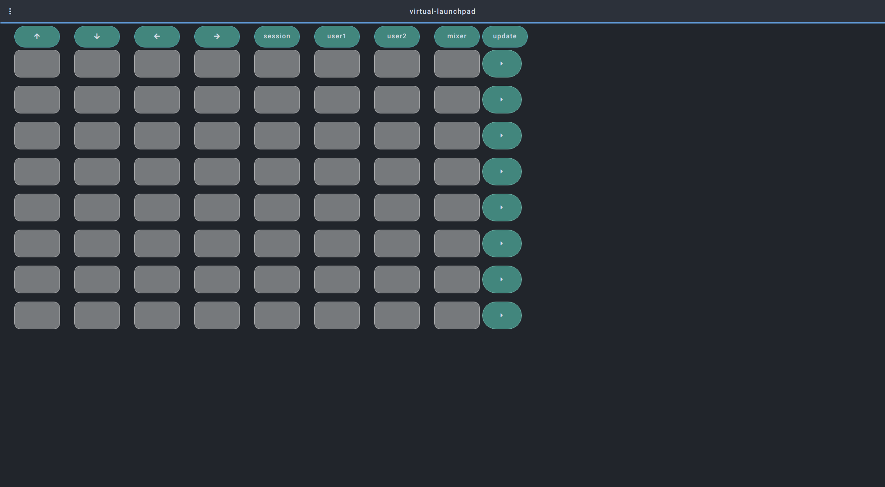

## Virtual-Launchpad

Virtual-launchpad v.1.01 open-stage-control template by Freddie Ventura

Usage : 
```
open-stage-control --load open-stage-control --midi virtual-launchpad:<MIDIOUTfromDAW>,<MIDIINFROMDAW> --load virtual-launchpad.json
```

## v.1.01 features

    - Working Mode Session
    - LED status of the PAD
    - To update the status on Ableton Press "update"

## Screenshot




